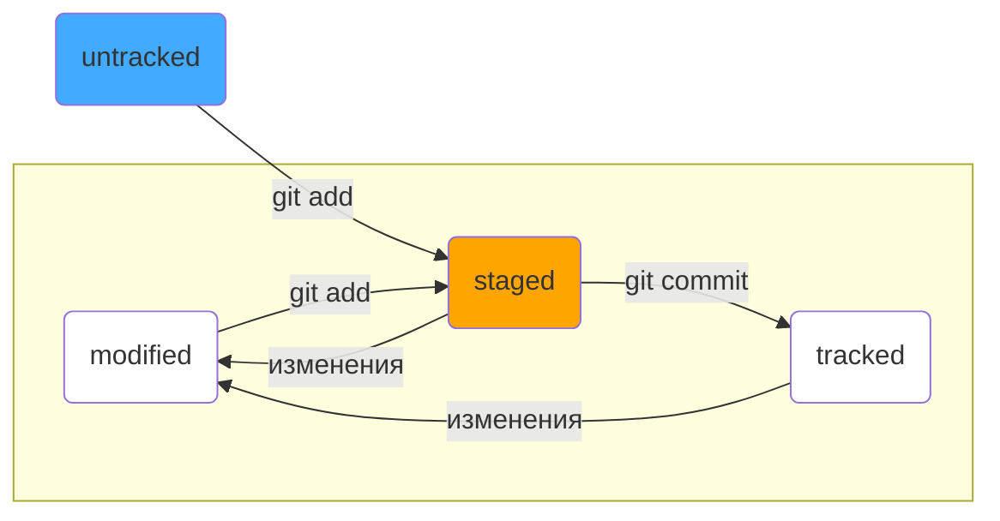

*Это краткий справочник по Git с описанием основных команд и понятий для работы с локальными и удаленными репозиториями.*
# Инициализация и настройки
1. Настроить имя и email
git config --global user.name "User Name" 
git config --global user.email example@gmail.com
2. Создать папку для проекта
`mkdir имя_папки`
3. Перейти в созданную папку
`cd имя_папки`
4. Инициализировать Git репозиторий
`git init`
ожидаемый результат: создается скрытая папка .git, в которой будет храниться вся история изменений.
5. Проверить состояние репозитория
`git status`
ожидаемый результат: On branch master или On branch main.
> проверяйте git status перед коммитом

# Работа с файлами и коммитами
`git add имя_файла` - добавление файла, чтобы Git начал его отслеживать.
После выполнения этой команды файл готов к сохранению в истории Git. 
`git add .` - добавление всей папки (включая все файлы), чтобы Git начал их отслеживать. 
`git add --all` - добавление всех файлов, чтобы Git начал их отслеживать. 
`git commit -m 'Описание коммита'` - сохранение изменений (создание коммита).
> сообщение коммитов должны быть информативными и четко описывать внесенные изменения.

# Просмотр историй и веток
`git log` - посмотреть историю коммитов.
Оснвная ветка main или master.
Коммиты хранятся в ветках.

# Работа с удаленным репозиторием (GitHub)
* Создать репозиторий на GitHub.
* Подключить SSH-ключ.
SSH-ключ состоит из публичного и прватного ключей. 
Публичный ключ шифрует данные, приватный расшифровывает. 
Привязка ключа: GitHub -> Settings -> SSG and GPG keys -> New SSH key.
* Связать локальный и удаленный репозиторий:
`git remote add origin <URL_репозитория>` 
> не делитесь приватным SSH-ключом.

# Хеш
**Хеш** — идентификатор коммита, полученный с помощью алгоритма SHA-1. Позволяет узнать автора, дату и содержимое закоммиченных файлов. Представляет собой короткую строку, состоящую из цифр 0-9 и латинских букв A-F (заглавных и/или строчных).

*Пример: 58422b8e8f75d977e9054a6259c703c2446b9e3f*

Хэш обладает следующими основными свойствами:
* если дважды получить хеш для одного набора данных, результат будет одинаковым.
* если изменить хоть что-то в исходных данных, хеш изменится.

Хеши и таблицу `хеш -> информация о коммите Git` сохраняет в служебных файлах в папке .git.

# Логи
**Лог** содержит описание коммита: хеш, автор, дата, сообщение. 
`git log --oneline` - выводит сокращенный лог с хешами и комментариями. 
Сокращённый хеш можно использовать так же, как и полный.
>Уникальная длина сокращенных хешей помогает идентифицировать коммит.

# HEAD
Файл HEAD указывает на последний коммит в системе git. 
Файл HEAD находится в папке .git и содержит ссылку на служебный файл refs/heads/master, содержащий хеш последнего коммита. 
Вместо хеша последнего коммита можно использовать слово HEAD.

# Статусы файлов в Git
В Git файлы могут находиться в следующих статусах:
* `untracked` - новые файлы, не отслеживаемые Git.
* `staged` - файл попадает в staging area после git add, то есть в список файлов, которые войдут в коммит.
* `tracked` - файлы, отслеживаемые Git, включая фиксированные и добавленные в staging area.
* `modified` - файлы с изменениями относительно последней версии в staging.

#### Типичный жизненный цикл файла в Git

1. Когда файл только что создан, то git ещё не отслеживает содержимое этого файла. Состояние: untracked.
2. После вызова команды `git add` файл добавился в staging area. Состояние: staged (+ tracked).
3. Сделали коммит с помощью `git commit`. Состояние: tracked.
4. Сделали изменение в файле. Состояние: modified (+ tracked).
5. Снова добавили в staging area с помощью `git add`. Состояния: staged (+ tracked).
6. Сделали коммит. Состояния: tracked.

# Оформление сообщений к коммитам
Сообщение к коммиту - это краткое описание изменений, которые были внесены в проект. От того, насколько понятно и аккуратно оно написано, зависит удобство работы с историей проекта. 
Существуют общие рекомендации по оформлению сообщений к коммитам в Git. Например, в выводе команды `git log --oneline` отображаются только 72 первых символа сообщения, поэтому его делают коротким и емким. 
Хорошее сообщение к коммиту должно быть:
* коротким - чтобы его было легко прочитать;
* информативным.

Единый стиль сообщений особенно важен при работе в команде. Если коммиты оформлены по-разному, историю становится сложнее читать и анализировать. 
В корпоративных проектах часто используеся соглашение, при котором в начале сообщения указывают задачи, а после - текст сообщения. 
Одним из самых популярных стандартов является **Conventional Commits**, где сообщение имеет формат `<type>: <сообщение>`, где type — это тип изменений (например feat, fix). 
GitHub позволяется использовать коммиты для работы с задачами. Если коммит «закрывает» или «решает» удобно указывть ее номер, например: "Исправить ошибку #123". 

Материал подготовлен с помощью [Яндекс-практикум](https://practicum.yandex.com/profile/qa-automation-engineer-python/?from=learn_subscriptions-with-prof-recommendations) 